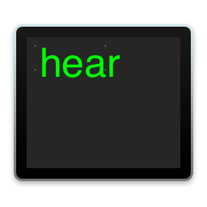

[](https://opensource.org/licenses/BSD-3-Clause)
[]()
[]()
[]()

# hear



### macOS speech recognition via the command line

`hear` is a command line interface for the built-in speech recognition capabilities in macOS.
This makes it possible to transcribe spoken audio input.

Apple's macOS has long shipped with the `say` tool, a command line interface
for the operating system's venerable speech synthesis capabilities. As of
10.15 "Catalina", it also ships with highly capable speech recognition for a variety
of languages. This project is an attempt to provide a robust CLI for this functionality
since no such tool is provided by Apple. `hear` supports speech recognition and
transcription of both microphone input and audio files in a variety of formats.

See the [man page](https://sveinbjorn.org/files/manpages/hear.1.html) for further details.

## Download

<a href="https://www.paypal.com/cgi-bin/webscr?cmd=_s-xclick&hosted_button_id=BDT58J7HYKAEE"></a>

`hear` is free, open source software written in Objective-C. The source code is freely
[available](https://github.com/sveinbjornt/hear) under a [BSD license](#bsd-license). 
**If you find this program useful, please [make a donation](https://sveinbjorn.org/donations).**

* **[⇩ Download hear 0.2](https://sveinbjorn.org/files/software/hear.zip)** 
(Intel/ARM 64-bit, macOS 10.15 or later, ~50 KB)

## Installation

After downloading and expanding the archive, change to the resulting directory and run
the following command:

```
bash install.sh
```

This will install the binary into `/usr/local/bin` and the man page into
`/usr/local/share/man/man1/`.

## Usage

### Transcribe audio from microphone
```
hear
```

### From microphone in single line output mode
```
hear -m
```

### Transcribe audio file
```
hear -d -i /path/to/someone_speaking.mp3 > transcribed_text.txt
```

Tbe `-d` flag specifies that only on-device speech recognition capabilities
should be used. Otherwise, data may be sent to Apple servers, which as of 
writing have a hard limit of something like 500 characters before quitting.

## Build

To build `hear` from source, run the following command from the repository root (requires Xcode command line build tools):

```
make build_unsigned
```

The resulting binary is created in `products/`.

## Test

To run tests on the built command line tool, execute the following command from the repository root:

```
bash test/test.sh
```

## BSD License 

Copyright (c) 2022 Sveinbjorn Thordarson
&lt;<a href="mailto:sveinbjorn@sveinbjorn.org">sveinbjorn@sveinbjorn.org</a>&gt;

Redistribution and use in source and binary forms, with or without modification,
are permitted provided that the following conditions are met:

1. Redistributions of source code must retain the above copyright notice, this
list of conditions and the following disclaimer.

2. Redistributions in binary form must reproduce the above copyright notice, this
list of conditions and the following disclaimer in the documentation and/or other
materials provided with the distribution.

3. Neither the name of the copyright holder nor the names of its contributors may
be used to endorse or promote products derived from this software without specific
prior written permission.

THIS SOFTWARE IS PROVIDED BY THE COPYRIGHT HOLDERS AND CONTRIBUTORS "AS IS" AND
ANY EXPRESS OR IMPLIED WARRANTIES, INCLUDING, BUT NOT LIMITED TO, THE IMPLIED
WARRANTIES OF MERCHANTABILITY AND FITNESS FOR A PARTICULAR PURPOSE ARE DISCLAIMED.
IN NO EVENT SHALL THE COPYRIGHT HOLDER OR CONTRIBUTORS BE LIABLE FOR ANY DIRECT,
INDIRECT, INCIDENTAL, SPECIAL, EXEMPLARY, OR CONSEQUENTIAL DAMAGES (INCLUDING, BUT
NOT LIMITED TO, PROCUREMENT OF SUBSTITUTE GOODS OR SERVICES; LOSS OF USE, DATA, OR
PROFITS; OR BUSINESS INTERRUPTION) HOWEVER CAUSED AND ON ANY THEORY OF LIABILITY,
WHETHER IN CONTRACT, STRICT LIABILITY, OR TORT (INCLUDING NEGLIGENCE OR OTHERWISE)
ARISING IN ANY WAY OUT OF THE USE OF THIS SOFTWARE, EVEN IF ADVISED OF THE
POSSIBILITY OF SUCH DAMAGE.
